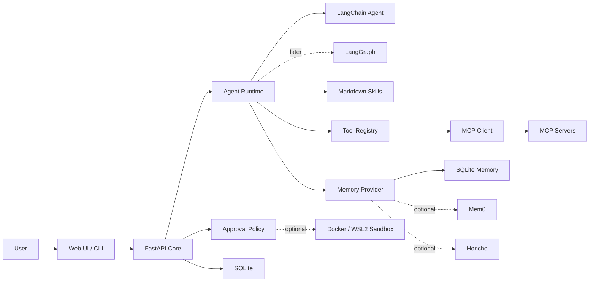

# easy-claw

easy-claw 是一个 Windows 优先、易部署、不重复造轮子的个人 AI 助手系统。它不是复杂 Gateway，也不是完整复刻 OpenClaw，而是把成熟 Agent 组件组合成普通个人用户能安装、配置和使用的本地助手。

核心理念：

> 不重复造轮子，只做成熟框架的组合、封装和易用化部署。

easy-claw 的目标用户不是要运营多租户 AI 平台的团队，而是在自己电脑上处理文档、代码、资料、文件和日常自动化的个人用户。

## 快速开始

当前第一版是 **CLI 优先 + FastAPI API 底座**。浏览器里的 `/docs` 是接口文档，不是聊天界面；Web UI 会在后续版本实现。

### 1. 准备环境

需要先安装：

- Python 3.11+
- Git
- [uv](https://docs.astral.sh/uv/)

进入项目目录：

```powershell
cd D:\Pathon\Programs\easy-claw
```

同步依赖：

```powershell
uv sync
```

### 2. 配置 `.env`

复制环境变量模板：

```powershell
Copy-Item .env.example .env
```

编辑 `.env`，至少配置 DeepSeek 模型和 API Key：

```env
EASY_CLAW_MODEL=deepseek-v4-pro
DEEPSEEK_API_KEY=你的 API Key
```

也可以不写 `.env`，直接在当前 PowerShell 会话中设置环境变量：

```powershell
$env:EASY_CLAW_MODEL = "deepseek-v4-pro"
$env:DEEPSEEK_API_KEY = "你的 API Key"
```

进程环境变量优先级高于 `.env` 文件。

### 3. 初始化数据库

```powershell
uv run easy-claw init-db
```

默认会创建产品数据库：

```text
data/easy-claw.db
```

`data/checkpoints.sqlite` 会在真实 Agent 对话需要 LangGraph checkpoint 时自动创建。

### 4. 启动本地 API 服务

推荐使用一键脚本：

```powershell
.\scripts\start.ps1
```

脚本会执行：

1. `uv sync`
2. `uv run easy-claw init-db`
3. `uv run easy-claw serve --host 127.0.0.1 --port 8787`

也可以手动启动：

```powershell
uv run easy-claw serve
```

启动后打开：

- 健康检查：[http://127.0.0.1:8787/health](http://127.0.0.1:8787/health)
- API 文档：[http://127.0.0.1:8787/docs](http://127.0.0.1:8787/docs)
- 会话列表：[http://127.0.0.1:8787/sessions](http://127.0.0.1:8787/sessions)

根路径 `http://127.0.0.1:8787/` 当前返回 `Not Found` 是正常的，因为第一版还没有 Web UI。

## CLI 使用

CLI 在 PowerShell 里使用，不是在浏览器里使用。

诊断当前配置：

```powershell
uv run easy-claw doctor
```

不用模型也可以跑 dry-run：

```powershell
uv run easy-claw chat --dry-run "你好，介绍一下这个项目"
```

真实对话：

```powershell
uv run easy-claw chat "请总结这个项目的 README"
```

交互式对话：

```powershell
uv run easy-claw chat --interactive
```

进入交互模式后，同一个 CLI 进程会复用同一个会话和 Agent thread。输入 `exit`、`quit` 或 `:q` 可以退出。

列出内置 Markdown Skills：

```powershell
uv run easy-claw skills list
```

列出显式产品记忆：

```powershell
uv run easy-claw memory list
```

第二版本地文档和强工具命令：

```powershell
uv run easy-claw docs summarize README.md
uv run easy-claw docs summarize docs --output data/reports/docs-summary.md
uv run easy-claw tools search "DeepSeek API tool calls"
uv run easy-claw tools run "pytest -q"
uv run easy-claw tools python "print('hello from easy-claw')"
```

## 项目定位

easy-claw 应该更像一个“个人工作台”，而不是一个后端系统：

- 用户打开本地 Web UI 或 CLI，就能开始对话和执行任务。
- 用户显式选择工作区，Agent 只在授权目录内读取和操作。
- Agent 可以总结本地文档、分析项目、搜索资料、生成报告、整理文件。
- Agent 能记住用户偏好、项目经验和常见流程。
- Agent 可以调用工具，但高风险操作必须先展示影响范围并让用户确认。

## 设计原则

- **Windows first**：安装、启动、路径处理和 PowerShell 脚本优先为 Windows 用户设计；Docker Desktop + WSL2 只作为高级沙箱能力，不作为基础模式前置条件。
- **Local first**：默认在本机运行 FastAPI、SQLite、Web UI 和配置文件，后续再支持远程模型与云记忆服务。
- **uv managed**：Python 依赖、虚拟环境、锁文件和开发命令统一交给 `uv` 管理；普通用户通过 `start.ps1` 间接使用。
- **Reuse first**：Agent 编排用 LangChain；长任务和恢复后期用 LangGraph；工具接入用 MCP；长期记忆接 Mem0 / Honcho；高风险执行隔离再接 Docker Desktop。
- **Human approval first**：安全不是项目主线，但高风险操作必须先展示命令、路径、影响范围和风险，再由用户确认。
- **Progressive enhancement**：MVP 只做可理解、可运行、可演示的个人助手核心，不一次性追求完整多 Agent 平台。

## MVP 范围

第一版 MVP 建议只做“本地个人助手骨架”，不要同时做完整 LangGraph、桌面端、多用户、插件市场和复杂沙箱。

MVP 必须包含：

- 本地 FastAPI 服务。
- SQLite 本地存储。
- `uv` 包管理：根目录 `pyproject.toml` 和 `uv.lock`。
- Web UI 或 CLI 中至少一个可用入口。
- LangChain Agent Runtime 封装。
- Markdown Skills 加载和选择。
- 基础工具注册表。
- MCP 工具适配层的接口定义；真实 MCP Server 接入放到 Phase 3。
- 记忆 Provider 接口和本地 SQLite 简化实现，用于保存偏好、项目笔记和任务摘要。
- 执行确认层：风险提示、人工确认、路径边界和审计日志。
- 本机命令执行器：只在用户确认后执行，并明确提示“不在沙箱内”。
- Windows 启动脚本 `start.ps1` 的设计和后续实现位置。

MVP 暂不包含：

- 完整 OpenClaw 级能力。
- 多平台消息 Gateway。
- 多用户权限系统。
- 完整桌面客户端。
- 复杂分布式任务队列。
- 自研 Agent 框架、自研工具协议、自研记忆系统。

## 部署难度分层

Docker Desktop 和 WSL2 对普通用户有明显门槛，所以 easy-claw 不应该把它们作为默认安装要求。

推荐分成两种形态：

| 形态 | 适合用户 | 是否需要 Docker / WSL2 | 能力边界 |
| --- | --- | --- | --- |
| 基础款 | 普通个人用户和个人开发者 | 不需要 | 对话、总结文档、读取用户选择的文件、Skills、SQLite 记忆；默认以只读工具为主；可在人工确认后执行本机命令，但必须明确标记为高风险且不在沙箱内 |
| 沙箱款 | 需要隔离执行命令的用户 | 需要 | 在 Docker 容器内运行命令，限制挂载、网络、CPU、内存和超时 |

第一版 MVP 应优先做好基础款。这样用户即使没有 Docker Desktop、没有启用 WSL2，也能使用 easy-claw 的核心个人助手能力。

## 典型任务

- 总结本地 PDF、Markdown、Word、代码文档。
- 分析 GitHub 或本地项目结构，生成架构说明。
- 搜索资料并整理为 Markdown 报告。
- 执行“先计划、再确认、再操作”的文件整理。
- 记录用户偏好，比如输出语言、代码风格、常用目录、报告格式。
- 把常见工作流沉淀成 Markdown Skills。
- 在用户确认后执行本地命令或容器内命令。

## 目标架构



详细工程设计见 [docs/architecture.md](docs/architecture.md)。

## Windows 友好启动方式

后续实现目标：

```powershell
.\start.ps1
```

`start.ps1` 应该做这些事：

1. 检查 `uv` 和 Git 是否可用。
2. 如果缺少 `uv`，提示官方安装命令，并在用户确认后安装。
3. 执行 `uv sync`，创建或复用 `.venv` 并同步依赖。
4. 初始化 `data/easy-claw.db`。
5. 用 `uv run` 启动 FastAPI 服务。
6. 启动 Web UI。
7. 如启用沙箱款，再检查 Docker Desktop / WSL2。
8. 自动打开 `http://localhost:8787`。

## 包管理和工具链

MVP 阶段只引入必要工具：

- **uv**：Python 包管理、虚拟环境、锁文件和命令入口。
- **pyproject.toml**：声明应用依赖、开发依赖和命令入口。
- **uv.lock**：锁定依赖版本，应该提交到仓库。
- **pytest**：测试工具，作为开发依赖。
- **ruff**：格式化和 lint 工具，作为开发依赖。

常用开发命令：

```powershell
uv sync
uv run easy-claw
uv run pytest
uv run ruff check .
uv run ruff format .
```

MVP 暂不需要 Poetry、Conda、Make、pre-commit、mypy / pyright、Turborepo、Nx。Web UI 第一版建议用 FastAPI 静态页面、模板或 HTMX，先不引入 Node / pnpm；如果后期改成 React / Vue，再单独引入 `pnpm`。

Docker Compose 作为可选入口，用于希望隔离运行环境的用户：

```powershell
docker compose up --build
```

## 建议目录结构

```text
easy-claw/
  pyproject.toml
  uv.lock
  README.md
  docs/
    architecture.md
  scripts/
    start.ps1
    doctor.ps1
  src/
    easy_claw/
      api/
      agent/
      memory/
      skills/
      tools/
      sandbox/
      approvals/
      storage/
      web/
  skills/
    core/
    user/
  data/
    easy-claw.db
  docker/
    sandbox.Dockerfile
  docker-compose.yml
```

## 开发路线

### Phase 0: 工程蓝图

当前阶段。产出项目定位、MVP 范围、架构设计、执行确认策略、目录结构和作品集说明。

### Phase 1: 本地服务骨架

实现 `pyproject.toml`、`uv.lock`、FastAPI、SQLite、配置加载、会话存储、基础 CLI 或 Web UI。先能通过 `start.ps1` 和 `uv run` 启动、能对话、能保存消息，并具备最小执行确认流程。

### Phase 2: 本地文档助手与强工具可用性

把第一版已经跑通的 Agent Runtime 做成真正可用的本地助手。重点不是完整安全体系，而是让用户能选择本机文件、读取和转换常见文档、联网搜索、运行常用项目命令、让 Agent 总结内容并生成 Markdown 报告。

第二版工具策略可以更激进：工作区只是默认上下文，不做硬沙箱；用户显式传入的路径和命令可以执行。系统只做清晰提示、超时、输出截断和活动日志，不做完整审批引擎、沙箱隔离或复杂权限系统。

### Phase 3: MCP 工具接入

在本地工具层稳定后，实现真实 MCP Client Adapter，支持列出工具、资源和提示词。先接文件系统、GitHub、搜索等成熟 MCP Server。

### Phase 4: 长期记忆

在 MVP 的 SQLite 简化记忆基础上，完善偏好管理、项目经验检索和任务摘要，再通过 Provider 接口接入 Mem0 或 Honcho。

### Phase 5: 沙箱款增强

引入可选 Docker Desktop + WSL2 命令执行容器。没有 Docker / WSL2 的用户仍可继续使用基础款；需要隔离执行时再切换到沙箱款。

### Phase 6: LangGraph 长任务

引入 LangGraph 做长任务、状态恢复、人审中断、失败重试和可恢复执行。

### Phase 7: 桌面端和打包

在 Web UI 稳定后，再考虑 Tauri / Electron 或 Windows 安装包。

## 作品集亮点

easy-claw 可以被描述为：

> 一个面向 Windows 个人用户的本地 AI Agent 工作台，通过 LangChain、MCP、长期记忆、Markdown Skills 和可选 Docker 沙箱，把成熟 Agent 生态封装成易安装、可审计、可确认、可扩展的个人助手系统。

核心成果：

- 把复杂 Agent 能力产品化为个人用户可理解的工作台。
- 用 Adapter 方式封装 LangChain、LangGraph、MCP、Mem0 / Honcho，避免重复造轮子。
- 设计了 Windows 友好的启动、检查、配置和渐进式沙箱方案：普通用户无需 Docker / WSL2，进阶用户可启用容器隔离。
- 把高风险工具调用前的人工确认和审计做成默认流程。
- 用 Markdown Skills 将任务经验沉淀为可复用流程。

## 参考资料

- [LangChain Agents](https://docs.langchain.com/oss/python/langchain/agents)
- [LangGraph Overview](https://docs.langchain.com/oss/python/langgraph/overview)
- [LangGraph Durable Execution](https://docs.langchain.com/oss/python/langgraph/durable-execution)
- [MCP Tools](https://modelcontextprotocol.io/docs/concepts/tools)
- [MCP Resources](https://modelcontextprotocol.io/docs/concepts/resources)
- [MCP Roots](https://modelcontextprotocol.io/specification/2025-11-25/client/roots)
- [Mem0 Overview](https://docs.mem0.ai/platform/overview)
- [Honcho Overview](https://docs.honcho.dev/v3/documentation/introduction/overview)
- [Docker Desktop WSL2](https://docs.docker.com/desktop/features/wsl/)
- [uv Documentation](https://docs.astral.sh/uv/)
