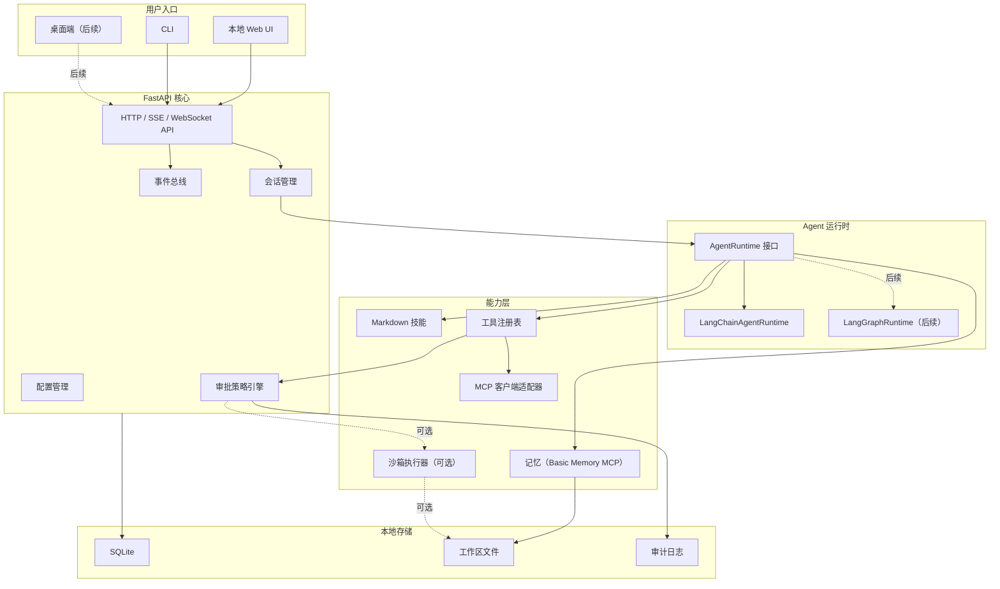

# easy-claw 架构设计

本文档给出 easy-claw 的工程化落地设计。目标是先做一个个人开发者能实现、Windows 用户能安装、功能边界清晰的本地 AI 助手，而不是一开始构建复杂平台。

## 1. 产品形态

easy-claw 的第一性目标是“个人助手体验”：

- 用户不需要理解 Agent 框架、MCP 协议、向量数据库或容器沙箱。
- 用户只需要选择工作区、描述任务、查看计划、确认高风险操作。
- 系统把复杂能力藏在核心服务和适配器里，对外呈现为任务、记忆、技能和工具。

推荐首屏不是管理后台，而是工作台：

- 左侧：会话、工作区、技能。
- 中间：对话和任务进度。
- 右侧：记忆、工具调用、待确认操作。

CLI 作为开发者入口，Web UI 作为普通用户入口，桌面端放到后期。

## 2. 架构总览



## 3. 模块设计

### 用户界面

职责：

- 提供对话入口。
- 展示 Agent 计划、执行进度和工具调用。
- 展示人工确认弹窗。
- 选择工作区和可用技能。
- 管理记忆开关、工具权限和执行模式。

MVP 可以只实现 CLI 或轻量 Web UI。更推荐 Web UI，因为普通个人用户更容易理解“待确认操作”“工具调用日志”和“记忆开关”。

### 核心服务

核心服务是本地服务，不做复杂平台化：

- FastAPI 提供本地 HTTP API。
- SQLite 保存会话和审计日志；LangGraph checkpoint 保存对话状态；Basic Memory MCP 保存项目级长期记忆。
- 配置文件保存模型提供方、默认工作区、启用的 MCP 服务和执行确认策略。
- 事件总线用于把 Agent 流式输出、工具调用、确认请求推给 UI。
- Python 依赖和运行入口由根目录 `pyproject.toml`、`uv.lock` 和 `uv run` 管理。

核心服务不应该直接写大量 Agent 逻辑，而是调用 `AgentRuntime` 接口。

### Agent 运行时

当前实现使用 LangChain `create_agent` 作为 Agent 运行时，底层是 LangGraph，同时通过 `AgentRuntime` 接口保持框架无关性。

当前接口：

```python
@dataclass(frozen=True)
class AgentRequest:
    prompt: str
    thread_id: str
    config: AppConfig | None
    workspace_path: Path | None = None
    skill_sources: Sequence[str] = ()

@dataclass(frozen=True)
class AgentResult:
    content: str
    thread_id: str
    usage: dict[str, int] | None = None

class LangChainAgentRuntime:
    def run(self, request: AgentRequest) -> AgentResult: ...
    def open_session(self, request: AgentRequest) -> LangChainAgentSession: ...
```

`AgentRequest` 通过 `config: AppConfig` 集中携带所有运行时配置（model、base_url、api_key、checkpoint_db_path、approval_mode、browser 开关、调用次数限制等），不再逐字段展开。`workspace_path` 可选，默认回退到 `config.default_workspace`。

`LangChainAgentRuntime` 的实现流程：

1. 通过 `langchain_openai.ChatOpenAI` 初始化 DeepSeek 模型（兼容 OpenAI API）
2. 调用 `langchain.agents.create_agent()` 创建 Agent，传入：
   - `tools`：easy-claw 核心工具、浏览器工具、MCP 工具和 skill 工具
   - `system_prompt`：基础行为说明和 skill 摘要
   - `middleware`：模型调用限制、工具调用限制和可选人工审批中间件
   - `checkpointer=SqliteSaver`：LangGraph SQLite checkpoint，用于对话状态持久化
   - `HumanInTheLoopMiddleware`：由 `EASY_CLAW_APPROVAL_MODE` 决定；默认 `permissive` 不打断，`balanced` / `strict` 对命令执行、Python 执行等高风险工具触发 LangGraph interrupt
3. 如触发 interrupt，通过 `ConsoleApprovalReviewer` 在控制台展示操作信息后请求用户 y/N 确认
4. `LangChainAgentSession.stream(prompt)` 将 LangGraph 消息流转换为 `StreamEvent`，在 CLI 和 WebSocket 中展示 token、工具调用、工具结果和审批提示
5. 返回 `AgentResult` 包含最后一条消息的文本内容和 token 用量

后期规划：
- 引入 LangGraph 长任务恢复能力
- 对 UI、记忆、工具和审批保持 `AgentRuntime` 接口不变

### 记忆

记忆不要一开始做复杂知识图谱。MVP 只需要解决三个问题：

- 用户偏好：语言、输出格式、常用目录、代码风格。
- 项目经验：项目结构、技术栈、常见命令、历史结论。
- 任务结果：报告、总结、决策和可复用经验。

当前实现：

- 长期记忆通过 MCP 的 Basic Memory 服务接入。
- `scripts\setup-mcp.ps1` 会创建项目内目录 `data\basic-memory`，并把 Basic Memory 项目 `easy-claw` 指向该目录。
- `mcp_servers.json.example` 默认使用 `uvx basic-memory mcp --project easy-claw`。
- Agent 系统提示会在检测到 Basic Memory 工具时，引导使用 `write_note`、`search_notes`、`read_note` 等工具保存和检索重要事实。
- 本机 `mcp_servers.json` 和 `data\basic-memory` 不提交到仓库，避免把用户记忆写入版本库。

后续如果需要脱离 MCP 做内建记忆，可以再抽象为：

```python
class MemoryProvider:
    async def ingest_turn(self, session_id: str, messages: list[Message]) -> None: ...
    async def search(self, query: str, scope: MemoryScope) -> list[MemoryItem]: ...
    async def get_profile(self) -> UserProfile: ...
    async def remember(self, item: MemoryItem) -> None: ...
```

可能的扩展顺序：

1. 保持 Basic Memory MCP 作为默认长期记忆。
2. 如需内建管理界面，再增加 SQLite 记忆索引和可编辑视图。
3. 如需云端或跨设备记忆，再接入 Mem0 或 Honcho。

记忆必须可见、可编辑、可删除。Agent 不能偷偷记忆敏感信息。

### Markdown 技能

技能是 easy-claw 的“经验沉淀层”。它不是代码插件市场，而是普通用户和开发者都能读懂的 Markdown 工作流。

建议格式：

```markdown
---
name: summarize-local-docs
description: 将选中的本地文档总结为 Markdown 报告。
risk: read-only
---

# Skill

1. 让用户选择文档。
2. 只读取用户选中的文件。
3. 提取关键要点。
4. 生成带来源的报告。
```

目录：

```text
skills/
  core/
    summarize-docs.md
    analyze-project.md
    generate-report.md
  user/
    my-weekly-review.md
```

技能的执行方式：

- 技能加载器解析 frontmatter 元数据。
- Skill Registry 按名称、标签、执行确认级别索引。
- Agent 在提示词里得到可用技能摘要。
- Skill 内容用于约束任务流程，不直接绕过执行确认。

### 工具和 MCP

MCP 是工具接入协议，不需要 easy-claw 自己发明工具协议。

easy-claw 当前实现 MCP 客户端适配器：

- 读取 `mcp_servers.json`，忽略 `_comment` 等元数据键。
- 支持 `EASY_CLAW_MCP_ENABLED=auto`：配置不存在时不启用，单个服务失败时跳过并继续启动。
- 支持 `${ENV_NAME}` 环境变量占位符，密钥可以放在 `.env` 或系统环境变量里。
- 通过 `langchain-mcp-adapters` 把 MCP Tool 包装成 LangChain Tool。
- 对 async-only MCP 工具补同步调用包装，兼容当前 `agent.invoke()` / `tool.invoke()` 执行链。
- 默认一键脚本配置 Basic Memory 和 Git；配置密钥后启用 GitHub 和高德地图。
- 工具调用过程通过 CLI / WebSocket 流式事件展示，细粒度 MCP 审计和工具健康页属于后续增强。

MCP 官方文档将工具设计为模型可自动发现和调用的能力，也强调用户应能拒绝工具调用，并在 UI 中清楚显示工具暴露和调用情况。easy-claw 应把这个建议产品化：

- UI 显示当前暴露给 Agent 的工具。
- 工具调用有明显提示。
- 写文件、执行命令、联网、上传、删除等操作必须确认。

MCP 资源和根目录的设计也适合 easy-claw：

- 资源用于暴露文件、数据库 schema、网页等上下文。
- 根目录用于限制文件系统边界。
- 工作区选择器本质上就是根目录的用户界面。

### 沙箱

Docker Desktop 和 WSL2 对普通用户有安装门槛，所以它们不能成为 easy-claw 的默认依赖。Windows 下也不应该从零实现沙箱。推荐采用两种产品形态：

| 形态 | 是否需要 Docker / WSL2 | 默认能力 | 风险策略 |
| --- | --- | --- | --- |
| 基础款 | 不需要 | 对话、文档总结、文件读写、技能、Basic Memory MCP 记忆；默认可直接执行本机命令和 Python | 明确提示“不在沙箱内”，记录审计日志；需要谨慎时切换到 `balanced` / `strict` |
| 沙箱款 | 需要 | 在 Docker 容器里执行命令 | 限制挂载、网络、CPU、内存、超时 |

MVP 应优先完成基础款：

- 默认 `EASY_CLAW_APPROVAL_MODE=permissive`，优先保证个人助手可用性，允许 Agent 主动执行本机命令和 Python。
- 默认不要求 Docker Desktop。
- 默认不要求 WSL2。
- 文件工具只读取用户选择的工作区。
- 写文件只允许写入新报告或 `runtime/output/`。
- 本机命令必须展示命令、工作目录、风险说明，并记录审计日志。
- 删除、覆盖、移动大量文件必须强确认。

沙箱款作为后续增强：

- 如果需要执行命令，先在 UI 展示命令、工作目录、风险说明。
- 用户确认后，优先在 Docker 容器里执行。
- 工作区默认只读挂载。
- 需要写入时挂载单独 `runtime/output/`。
- 默认禁用容器网络，需要联网时单独确认。
- 限制 CPU、内存、超时和输出大小。

Docker Desktop 的 WSL2 后端适合进阶 Windows 用户，因为 Docker 官方说明它允许 Windows 用户通过 WSL2 使用 Linux 工作空间，并减少维护 Windows / Linux 双套脚本的成本。但 WSL2 不是强隔离安全边界，所以 easy-claw 仍要保留路径限制、确认机制和审计日志。

### 执行确认

执行确认通过 LangGraph 的 Human-in-the-Loop（HITL）机制实现，不自行构建审批引擎。默认模式偏可用性，谨慎模式再启用 HITL。

当前机制：

1. `permissive`：`interrupt_on={}`，Agent 可直接调用本地命令、Python 和文件写入工具，执行记录进入审计日志
2. `balanced` / `strict`：`interrupt_on` 覆盖 `edit_file`、`execute`、`write_file`、`run_command`、`run_python`
3. `ConsoleApprovalReviewer` 在控制台展示操作信息（工具名称、参数、描述），请求用户输入 y/N
4. 用户确认后，通过 `Command(resume={"decisions": [...]})` 恢复 Agent 执行
4. 提供 `StaticApprovalReviewer`（始终批准/拒绝）用于自动化测试
5. 所有工具调用（命令执行、Python 运行、搜索、文档读取）写入 `audit_logs` 表

`ApprovalReviewer` 接口：

```python
class ApprovalReviewer(Protocol):
    def review(self, interrupts: Sequence[object]) -> list[dict[str, object]]:
        """根据 interrupt payload 返回 LangGraph HITL 决策。"""
```

后期规划：扩展 interrupt 覆盖范围（shell 命令执行、网络访问等高风险操作），并增加风险分级提示。

## 4. 数据模型

当前 SQLite 表：

- `sessions`: `id`, `title`, `workspace_path`, `model`, `created_at`, `updated_at`
- `audit_logs`: `id`, `event_type`, `payload_json`, `created_at`

对话消息和 checkpoint 由 LangGraph 的 `SqliteSaver` 独立管理（`checkpoints.sqlite`），不在 easy-claw 的应用层 schema 中。
Basic Memory 的长期记忆保存在 `data\basic-memory`，由 Basic Memory MCP 服务管理，不写入 easy-claw 的业务数据库。

## 5. API

当前 API 端点：

```text
GET  /
GET  /health
GET  /slash-commands
GET  /skills
GET  /mcp
GET  /browser
GET  /sessions
POST /sessions
GET  /sessions/resolve/{session_id}
GET  /sessions/{session_id}
WS   /ws/chat
```

HTTP API 用于健康检查、能力状态和会话管理。`/slash-commands` 从 CLI slash registry 暴露同一份命令定义，Web `/help` 基于该接口渲染。本地 Web 聊天页面通过 `/ws/chat` 建立 WebSocket 连接，服务端复用 `LangChainAgentSession.stream()` 把 token、工具调用和工具结果转发给前端。CLI 交互式聊天仍是默认入口。

## 6. Windows 部署设计

### start.ps1

一键启动：

```powershell
.\scripts\start.ps1           # 交互式聊天
.\scripts\start.ps1 -ApiServer  # API 模式
```

职责：

- 检查 `uv` 是否可用。
- 执行 `uv sync` 同步依赖。
- 初始化 SQLite（`uv run easy-claw init-db`）。
- 如果指定 `-ApiServer`：启动 FastAPI 服务。
- 否则：启动交互式聊天（`uv run easy-claw chat --interactive`）。

### doctor.ps1

用于诊断：

```powershell
.\scripts\doctor.ps1
```

检查项：

- `uv` 是否可用。
- `pyproject.toml` 和 `uv.lock` 是否存在。
- Git 是否可用。
- 数据库是否可写。
- 通过 `uv run easy-claw doctor` 打印详细诊断信息。

### Docker Compose

Compose 用于隔离运行环境，不作为普通用户默认入口：

```text
services:
  api:
    build: .
    ports:
      - "8787:8787"
    volumes:
      - ./data:/app/data
      - ./skills:/app/skills:ro
```

### uv 包管理

easy-claw 的 Python 工具链统一使用 `uv`：

- 根目录保留一个 `pyproject.toml`，声明运行依赖、开发依赖和命令入口。
- `uv.lock` 必须提交，用于复现依赖环境。
- `start.ps1` 封装 `uv sync` 和 `uv run`，普通用户不需要理解包管理细节。
- 开发者直接使用 `uv run pytest`、`uv run ruff check .`、`uv run ruff format .`。

MVP 推荐工具：

| 工具 | 用途 | 是否默认需要 |
| --- | --- | --- |
| uv | Python 包管理、虚拟环境、锁文件、运行命令 | 需要 |
| pytest | 测试 | 开发依赖 |
| ruff | 格式化和 lint | 开发依赖 |
| Docker Desktop | 沙箱款命令隔离 | 可选 |
| pnpm | React / Vue 前端 | 后期可选 |

MVP 不建议引入 Poetry、Conda、Make、pre-commit、mypy / pyright、Turborepo、Nx 或复杂 monorepo 工具。Web UI 第一版可以由 FastAPI 提供静态页面、模板或 HTMX；如果后期需要更复杂的前端，再引入 `pnpm`。

## 7. 项目目录结构

```text
easy-claw/
  pyproject.toml
  uv.lock
  README.md
  .env.example
  docs/
    architecture.md
  scripts/
    start.ps1
    doctor.ps1
  src/
    easy_claw/
      config.py
      defaults.py
      skills.py
      workspace.py
      api/
        app.py
        schemas.py
        websocket.py
      agent/
        approvals.py
        langchain_runtime.py
        middleware.py
        prompts.py
        streaming.py
        toolset.py
        types.py
      cli/
        interactive.py
        slash.py
        views.py
      storage/
        db.py
        repositories.py
      tools/
        base.py
        browser.py
        commands.py
        core.py
        documents.py
        python_runner.py
        search.py
  skills/
    core/
    user/
  tests/
    agent/
    api/
    cli/
    core/
    storage/
    tools/
  data/
```

## 8. MVP 实现切片

推荐 MVP 第一版只做这些：

1. 根目录 `pyproject.toml`、`uv.lock` 和 `uv run easy-claw` 入口。
2. `GET /health` 和本地启动。
3. SQLite 初始化。
4. 创建会话并通过 LangGraph checkpoint 保存对话状态。
5. 一个 LangChain Agent 运行时封装。
6. 一个只读文件总结工具。
7. 技能加载器加载 `skills/core/*.md`。
8. 审批模式可配置：默认 `permissive` 保障可用性，`balanced` / `strict` 对命令执行和文件写入发起人工确认。
9. 一个本机命令执行器，默认在工作区内直接运行，并明确显示“不在沙箱内”。
10. 通过 Basic Memory MCP 接入项目级长期记忆，默认目录为 `data\basic-memory`。
11. MCP 客户端适配器接入真实 MCP 服务，当前默认支持 Basic Memory、Git，并可配置 GitHub 和高德地图。
12. CLI 或 Web UI 能发起任务并显示结果。

不要第一轮就做：

- 多模型管理后台。
- 插件市场。
- 桌面安装器。
- 完整 LangGraph 流程引擎。
- 复杂向量检索。
- 无边界的 shell 自动执行。基础款允许工作区内本机命令执行，但保留超时、输出截断和审计日志。

## 9. 组件封装策略

| 能力 | 复用组件 | easy-claw 只做什么 |
| --- | --- | --- |
| Agent 编排 | LangChain / LangGraph | 封装 `AgentRuntime`，注册工具、技能工具和中间件 |
| 长任务恢复 | LangGraph | 后期封装 `LangGraphRuntime` |
| 工具协议 | MCP | 实现 MCP 客户端适配器、环境变量展开、auto 容错和 async-only 工具同步包装 |
| 长期记忆 | Basic Memory MCP | 用项目目录内 `data\basic-memory` 保存记忆；Mem0 / Honcho 作为后续可选提供方 |
| 技能沉淀 | Markdown | 加载器、注册表、技能选择器 |
| 包管理 | uv | 管理 `pyproject.toml`、`uv.lock`、`.venv` 和运行命令 |
| 本地 API | FastAPI | 本地服务和事件流 |
| 本地状态 | SQLite | 会话、审计日志、LangGraph checkpoint；记忆由 Basic Memory MCP 管理 |
| 执行确认 | 本地审批策略 | 可配置 `permissive` / `balanced` / `strict`，记录审计，谨慎模式等待人工确认 |
| 沙箱 | 可选 Docker Desktop + WSL2 | 仅在沙箱款中启动、挂载、限制、审计 |

这个封装方式可以避免把第三方框架写死在业务逻辑里。后续替换模型、记忆服务或 Agent 运行时时，UI 和核心服务不需要大改。

## 10. 路线图

### v0.0: 文档和蓝图

- README
- 架构设计
- MVP 范围
- 执行确认策略
- 目录结构

### v0.1: 本地服务

- uv + pyproject.toml + uv.lock
- FastAPI
- SQLite
- 会话 API
- CLI 或 Web UI
- 基础配置
- 最小执行确认 API

### v0.2: 本地文档助手与强工具可用性 (已完成)

- 复用第一版已有的 Agent 运行时封装和技能加载器
- 工作区作为默认上下文，但允许用户显式传入本机路径
- 当前版本通过工作区上下文约束本地工具执行；专用文件编辑工具后续补充
- 文件选择、读取和路径解析
- MarkItDown 文档转 Markdown
- DDGS / Tavily 双后端搜索工具
- PowerShell / Shell 命令工具，默认设置超时和输出截断
- Python 脚本 / 片段执行工具，用于本地数据和文档处理
- 交互式对话模式（`chat --interactive`），复用同一 session 和 checkpoint
- 轻量活动日志（`audit_logs`），记录搜索、命令执行、Python 运行等关键动作
- LangGraph interrupt + ConsoleApprovalReviewer 实现文件写入审批
- 暂不做完整审批引擎、沙箱隔离和复杂权限系统

### v0.3: CLI 流式输出与工具调用显示 (已完成)

v0.3 解决了工具调用过程不可见的问题，让用户能看到 Agent 调了什么工具、入参是什么、返回值摘要是什么。

已实现：

- `LangChainAgentSession` 新增 `stream(prompt)`，内部调用 `agent.stream(..., stream_mode="messages")` 并逐个转换 LangGraph event
- 新增 `StreamEvent` 数据类：区分 token 增量（`token`）、工具调用开始（`tool_call_start`）、工具调用结果（`tool_call_result`）、审批提示（`approval_required`）、最终消息（`done`）
- `_invoke_with_approval` 和 `run()` 保持同步路径不变；流式路径单独处理 interrupt，并用 `Command(resume={"decisions": ...})` 恢复执行
- CLI `chat --interactive` 用 Rich `Panel` 实时渲染：token 流逐字输出，工具调用以独立面板穿插显示（工具名、参数、返回值摘要）
- WebSocket `/ws/chat` 复用同一套流式事件，供本地 Web 页面使用

### v0.4: MCP 工具接入 (已完成)

- 通过 `langchain-mcp-adapters` 接入真实 MCP 客户端
- `EASY_CLAW_MCP_ENABLED=auto` 默认自动加载本机配置，服务失败时跳过并继续启动
- `mcp_servers.json.example` 提供 Basic Memory、Git、GitHub、高德地图示例
- `scripts\setup-mcp.ps1` 一键生成或合并本机 `mcp_servers.json`
- 支持 `${ENV_NAME}` 环境变量占位符，避免把密钥写入示例配置
- 对 async-only MCP 工具补同步包装，兼容当前同步 Agent 调用链
- 当前缺口：`doctor` 只统计 MCP 配置数量，还没有 live 启动检查和逐服务健康诊断

### v0.5: basic-memory 记忆接入 (已完成)

- Basic Memory MCP 默认使用项目 `easy-claw`
- 一键脚本自动创建项目内记忆目录 `data\basic-memory`
- 新用户启用 MCP 时会自动注册 Basic Memory 项目；老用户已有项目不会被脚本自动迁移
- Agent 系统提示会引导使用 Basic Memory 工具保存和检索重要事实
- 当前缺口：还没有内建记忆管理 UI，也没有接入 Mem0 或 Honcho

### v0.6: MCP 诊断和记忆管理 (计划中)

- `doctor --mcp-live` 或等价能力：逐个 MCP 服务启动、列出工具数量、报告错误和超时
- MCP 服务级别超时和更友好的错误提示
- Basic Memory 记忆浏览、删除、导出入口
- 可选 Mem0 / Honcho 提供方

### v0.7: 可选沙箱

- 可选 Docker Runner
- 只读挂载和输出目录

### v0.8: LangGraph 长任务

- 可暂停任务
- 人审恢复
- 失败恢复
- 长任务进度
- Web UI 流式输出（SSE / WebSocket）

### v0.9: 桌面体验

- 桌面壳或安装器
- 托盘启动
- 自动更新配置

## 11. 成果描述

用于作品集或项目申请时，可以这样描述：

easy-claw 是一个面向 Windows 个人用户的本地 AI Agent 工作台。项目通过 LangChain / LangGraph、MCP、Basic Memory、Markdown 技能和可选 Docker Desktop 沙箱，将成熟 Agent 生态封装成易安装、可确认、可扩展的个人助手系统。它重点解决普通用户在本地使用 Agent 时遇到的安装复杂、工具危险、记忆割裂、技能不可复用和 Windows 沙箱困难等问题。

技术亮点：

- 基于适配器的 Agent 运行时设计，封装 LangChain / LangGraph，保留后续替换运行时的边界。
- 以 MCP 作为工具接入边界，不自研工具协议，并处理 auto 容错、环境变量展开和 async-only 工具同步包装。
- 将 Markdown 技能作为可读、可版本化、可复用的任务流程。
- 通过 Basic Memory MCP 提供项目级长期记忆，后续可扩展到 Mem0 / Honcho。
- 在 Windows 上用 `start.ps1` 降低基础部署门槛，并把 Docker Desktop / WSL2 设计为可选沙箱能力。
- 把高风险操作前的人工确认和审计日志放进核心流程。

## 12. 官方参考

- [LangChain Agents](https://docs.langchain.com/oss/python/langchain/agents)
- [LangChain Overview](https://docs.langchain.com/oss/python/langchain/overview)
- [LangGraph Overview](https://docs.langchain.com/oss/python/langgraph/overview)
- [LangGraph Durable Execution](https://docs.langchain.com/oss/python/langgraph/durable-execution)
- [LangGraph Human-in-the-loop](https://docs.langchain.com/oss/python/langchain/human-in-the-loop)
- [MCP Tools](https://modelcontextprotocol.io/docs/concepts/tools)
- [MCP Resources](https://modelcontextprotocol.io/docs/concepts/resources)
- [MCP Roots](https://modelcontextprotocol.io/specification/2025-11-25/client/roots)
- [Mem0 Overview](https://docs.mem0.ai/platform/overview)
- [Honcho Overview](https://docs.honcho.dev/v3/documentation/introduction/overview)
- [Docker Desktop WSL2](https://docs.docker.com/desktop/features/wsl/)
- [uv Documentation](https://docs.astral.sh/uv/)
