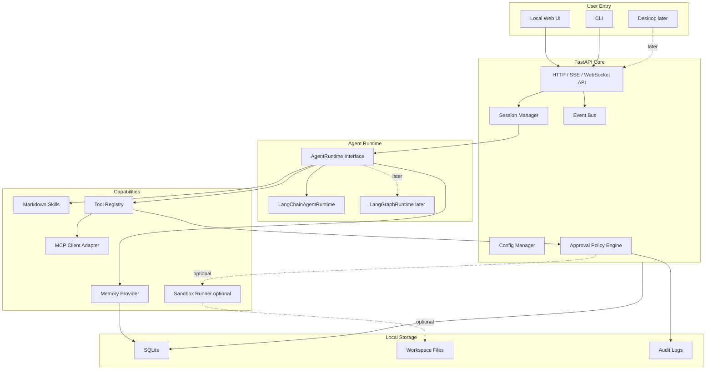

# easy-claw Architecture

本文档给出 easy-claw 的工程化落地设计。目标是先做一个个人开发者能实现、Windows 用户能安装、功能边界清晰的本地 AI 助手，而不是一开始构建复杂平台。

## 1. 产品形态

easy-claw 的第一性目标是“个人助手体验”：

- 用户不需要理解 Agent 框架、MCP 协议、向量数据库或容器沙箱。
- 用户只需要选择工作区、描述任务、查看计划、确认高风险操作。
- 系统把复杂能力藏在 Core 和 Adapter 里，对外呈现为任务、记忆、技能和工具。

推荐首屏不是管理后台，而是工作台：

- 左侧：会话、工作区、技能。
- 中间：对话和任务进度。
- 右侧：记忆、工具调用、待确认操作。

CLI 作为开发者入口，Web UI 作为普通用户入口，桌面端放到后期。

## 2. 架构总览



## 3. 模块设计

### UI

职责：

- 提供对话入口。
- 展示 Agent 计划、执行进度和工具调用。
- 展示人工确认弹窗。
- 选择工作区和可用 Skills。
- 管理记忆开关、工具权限和执行模式。

MVP 可以只实现 CLI 或轻量 Web UI。更推荐 Web UI，因为普通个人用户更容易理解“待确认操作”“工具调用日志”和“记忆开关”。

### Core

Core 是本地服务，不做复杂平台化：

- FastAPI 提供本地 HTTP API。
- SQLite 保存会话、消息、审批、工具调用、技能索引和记忆摘要。
- 配置文件保存模型 Provider、默认工作区、启用的 MCP Server、执行确认策略。
- Event Bus 用于把 Agent 流式输出、工具调用、确认请求推给 UI。
- Python 依赖和运行入口由根目录 `pyproject.toml`、`uv.lock` 和 `uv run` 管理。

Core 不应该直接写大量 Agent 逻辑，而是调用 `AgentRuntime` 接口。

### Agent Runtime

封装目标：

- 第一版用 LangChain Agent 快速获得工具调用和模型编排能力。
- 后期用 LangGraph 处理长任务、状态恢复、人审中断和可恢复执行。
- 业务代码不直接依赖 LangChain / LangGraph 的细节。

建议接口：

```python
class AgentRuntime:
    async def run(self, request: AgentRequest) -> AgentResult:
        ...

    async def stream(self, request: AgentRequest) -> AsyncIterator[AgentEvent]:
        ...

    async def resume(self, run_id: str, decision: HumanDecision) -> AgentResult:
        ...
```

LangChain 官方文档已经将 agents 描述为可使用模型和工具的高级接口，并且新版 LangChain agents 建立在 LangGraph 能力之上，用于获得持久执行、流式、人审和持久化等能力。因此 easy-claw 的设计应是：

- v0.1：`LangChainAgentRuntime`
- v0.6：`LangGraphRuntime`
- 对 UI、Memory、Tools、Approval 保持接口不变。

### Memory

记忆不要一开始做复杂知识图谱。MVP 只需要解决三个问题：

- 用户偏好：语言、输出格式、常用目录、代码风格。
- 项目经验：项目结构、技术栈、常见命令、历史结论。
- 任务结果：报告、总结、决策和可复用经验。

建议接口：

```python
class MemoryProvider:
    async def ingest_turn(self, session_id: str, messages: list[Message]) -> None:
        ...

    async def search(self, query: str, scope: MemoryScope) -> list[MemoryItem]:
        ...

    async def get_profile(self) -> UserProfile:
        ...

    async def remember(self, item: MemoryItem) -> None:
        ...
```

实现顺序：

1. `SQLiteMemoryProvider`：本地摘要、偏好、项目笔记。
2. `Mem0MemoryProvider`：接入 Mem0 做长期记忆。
3. `HonchoMemoryProvider`：接入 Honcho 做更强的用户建模和上下文推理。

记忆必须可见、可编辑、可删除。Agent 不能偷偷记忆敏感信息。

### Markdown Skills

Skills 是 easy-claw 的“经验沉淀层”。它不是代码插件市场，而是普通用户和开发者都能读懂的 Markdown 工作流。

建议格式：

```markdown
---
name: summarize-local-docs
description: Summarize selected local documents into a Markdown report.
risk: read-only
---

# Skill

1. Ask the user to select documents.
2. Read only selected files.
3. Extract key points.
4. Produce a report with sources.
```

目录：

```text
skills/
  core/
    summarize-docs.md
    analyze-project.md
    generate-report.md
  user/
    my-weekly-review.md
```

Skills 的执行方式：

- Skill Loader 解析 frontmatter。
- Skill Registry 按名称、标签、执行确认级别索引。
- Agent 在提示词里得到可用 Skills 摘要。
- Skill 内容用于约束任务流程，不直接绕过执行确认。

### Tools and MCP

MCP 是工具接入协议，不需要 easy-claw 自己发明工具协议。

easy-claw 只实现 MCP Client Adapter：

- 发现 MCP Server。
- 列出 tools、resources、prompts。
- 把 MCP Tool 包装成 LangChain Tool。
- 调用前交给 Approval Policy 做风险提示和确认判断。
- 调用后记录审计日志。

MCP 官方文档将 tools 设计为模型可自动发现和调用的能力，也强调用户应能拒绝工具调用，并在 UI 中清楚显示工具暴露和调用情况。easy-claw 应把这个建议产品化：

- UI 显示当前暴露给 Agent 的工具。
- 工具调用有明显提示。
- 写文件、执行命令、联网、上传、删除等操作必须确认。

MCP Resources 和 Roots 的设计也适合 easy-claw：

- Resources 用于暴露文件、数据库 schema、网页等上下文。
- Roots 用于限制文件系统边界。
- 工作区选择器本质上就是 Roots 的用户界面。

### Sandbox

Docker Desktop 和 WSL2 对普通用户有安装门槛，所以它们不能成为 easy-claw 的默认依赖。Windows 下也不应该从零实现沙箱。推荐采用两种产品形态：

| 形态 | 是否需要 Docker / WSL2 | 默认能力 | 风险策略 |
| --- | --- | --- | --- |
| 基础款 | 不需要 | 对话、文档总结、只读文件访问、Skills、SQLite 记忆；人工确认后可执行本机命令 | 明确提示“不在沙箱内”，记录审计日志；危险写操作需要强确认 |
| 沙箱款 | 需要 | 在 Docker 容器里执行命令 | 限制挂载、网络、CPU、内存、超时 |

MVP 应优先完成基础款：

- 默认不自动执行命令；用户人工确认后，可以执行本机命令。
- 默认不要求 Docker Desktop。
- 默认不要求 WSL2。
- 文件工具只读取用户选择的工作区。
- 写文件只允许写入新报告或 `runtime/output/`。
- 本机命令必须展示命令、工作目录、风险说明，并记录审计日志。
- 删除、覆盖、移动大量文件必须强确认。

沙箱款作为后续增强：

- 如果需要执行命令，先在 UI 展示命令、工作目录、风险说明。
- 用户确认后，优先在 Docker 容器里执行。
- 工作区默认只读挂载。
- 需要写入时挂载单独 `runtime/output/`。
- 默认禁用容器网络，需要联网时单独确认。
- 限制 CPU、内存、超时和输出大小。

Docker Desktop 的 WSL2 后端适合进阶 Windows 用户，因为 Docker 官方说明它允许 Windows 用户通过 WSL2 使用 Linux 工作空间，并减少维护 Windows / Linux 双套脚本的成本。但 WSL2 不是强隔离安全边界，所以 easy-claw 仍要保留路径限制、确认机制和审计日志。

### Execution Approval

执行确认是 easy-claw 的工具调用护栏，不是项目主线。MVP 不需要复杂的安全系统，只要确保高风险操作在执行前让用户看清楚、点确认，并留下审计记录。

建议把操作分成三类：

| Level | 示例 | 默认策略 |
| --- | --- | --- |
| Low | 读取用户选择的文件、生成摘要 | 允许 |
| Confirm | 写入新文件、运行测试、访问网络、执行 shell、上传文件 | 需要确认 |
| Strong Confirm | 删除、覆盖、移动大量文件、读取密钥类文件、访问系统目录 | 强确认，默认给出风险提示 |

确认弹窗至少展示：

- 要执行的操作类型。
- 命令、路径、URL 或目标文件。
- 工作目录和影响范围。
- 是否在沙箱内执行。
- Agent 给出的执行理由。
- 允许、拒绝、修改后再执行。

默认规则：

- 执行 shell 命令前必须人工确认。
- 删除、覆盖、移动大量文件前必须强确认。
- 不自动读取密钥类文件；如果用户明确选择，也必须强确认。
- 不在工作区外写文件，除非用户明确指定目标路径。
- 不把本地文件上传到外部服务，除非用户明确确认。
- 所有 Confirm / Strong Confirm 操作写入审计日志。

确认请求结构：

```json
{
  "action": "run_command",
  "risk": "confirm",
  "working_dir": "D:/Pathon/Programs/easy-claw",
  "command": "pytest",
  "reason": "Run tests requested by the user",
  "requires_approval": true
}
```

## 4. 数据模型

MVP SQLite 表：

```text
user_profile
workspaces
sessions
messages
agent_runs
tool_calls
approval_requests
skills
memory_items
settings
audit_logs
```

最小字段建议：

- `sessions`: `id`, `workspace_id`, `title`, `created_at`, `updated_at`
- `messages`: `id`, `session_id`, `role`, `content`, `metadata_json`, `created_at`
- `tool_calls`: `id`, `run_id`, `tool_name`, `args_json`, `risk`, `status`, `result_json`
- `approval_requests`: `id`, `run_id`, `action_json`, `decision`, `decided_at`
- `memory_items`: `id`, `scope`, `key`, `content`, `source`, `created_at`, `updated_at`
- `audit_logs`: `id`, `event_type`, `payload_json`, `created_at`

## 5. API 草案

```text
GET  /health
GET  /workspaces
POST /workspaces

GET  /sessions
POST /sessions
GET  /sessions/{id}
POST /sessions/{id}/messages
GET  /sessions/{id}/events

GET  /skills
POST /skills/reload

GET  /tools
POST /tools/{name}/call

GET  /memory
POST /memory
DELETE /memory/{id}

GET  /approvals
POST /approvals/{id}/decision
```

流式输出可以先用 Server-Sent Events，后期再按 UI 复杂度引入 WebSocket。

## 6. Windows 部署设计

### start.ps1

目标是让用户少输入命令：

```powershell
.\start.ps1
```

脚本职责：

- 检查 PowerShell 版本。
- 检查 `uv` 是否可用。
- 如果缺少 `uv`，提示官方 Windows 安装命令，并在用户确认后安装。
- 检查是否存在 `.venv`。
- 执行 `uv sync` 同步依赖。
- 初始化 SQLite。
- 如果启用沙箱款，检查 Docker Desktop / WSL2 状态；基础款不检查。
- 通过 `uv run` 启动 API。
- 启动 Web UI。
- 打开浏览器。

### doctor.ps1

用于诊断：

```powershell
.\scripts\doctor.ps1
```

检查项：

- `uv` 是否可用。
- `pyproject.toml` 和 `uv.lock` 是否存在。
- Git 是否可用。
- Docker 是否可用，如果不可用则提示沙箱款不可用。
- WSL2 是否可用，如果不可用则提示沙箱款不可用。
- 端口是否被占用。
- 数据库是否可写。
- 配置文件是否有效。

### Docker Compose

Compose 用于隔离运行环境，不作为普通用户默认入口：

```text
services:
  api:
    build: .
    ports:
      - "8787:8787"
    volumes:
      - ./data:/app/data
      - ./skills:/app/skills:ro
```

### uv 包管理

easy-claw 的 Python 工具链统一使用 `uv`：

- 根目录保留一个 `pyproject.toml`，声明运行依赖、开发依赖和命令入口。
- `uv.lock` 必须提交，用于复现依赖环境。
- `start.ps1` 封装 `uv sync` 和 `uv run`，普通用户不需要理解包管理细节。
- 开发者直接使用 `uv run pytest`、`uv run ruff check .`、`uv run ruff format .`。

MVP 推荐工具：

| 工具 | 用途 | 是否默认需要 |
| --- | --- | --- |
| uv | Python 包管理、虚拟环境、锁文件、运行命令 | 需要 |
| pytest | 测试 | 开发依赖 |
| ruff | 格式化和 lint | 开发依赖 |
| Docker Desktop | 沙箱款命令隔离 | 可选 |
| pnpm | React / Vue 前端 | 后期可选 |

MVP 不建议引入 Poetry、Conda、Make、pre-commit、mypy / pyright、Turborepo、Nx 或复杂 monorepo 工具。Web UI 第一版可以由 FastAPI 提供静态页面、模板或 HTMX；如果后期需要更复杂的前端，再引入 `pnpm`。

## 7. 项目目录结构

```text
easy-claw/
  pyproject.toml
  uv.lock
  README.md
  docs/
    architecture.md
    mvp-plan.md
    execution-approval.md
  scripts/
    start.ps1
    doctor.ps1
  src/
    easy_claw/
      api/
        main.py
        routes/
      agent/
        runtime.py
        langchain_runtime.py
        langgraph_runtime.py
      memory/
        provider.py
        sqlite_provider.py
        mem0_provider.py
        honcho_provider.py
      skills/
        loader.py
        registry.py
      tools/
        registry.py
        mcp_adapter.py
      sandbox/
        runner.py
        docker_runner.py
      approvals/
        policy.py
        requests.py
      storage/
        db.py
        migrations/
      web/
        static/
        templates/
  skills/
    core/
    user/
  data/
  docker/
    sandbox.Dockerfile
  docker-compose.yml
```

## 8. MVP 实现切片

推荐 MVP 第一版只做这些：

1. 根目录 `pyproject.toml`、`uv.lock` 和 `uv run easy-claw` 入口。
2. `GET /health` 和本地启动。
3. SQLite 初始化。
4. 创建会话和保存消息。
5. 一个 LangChain Agent Runtime 封装。
6. 一个只读文件总结工具。
7. Skill Loader 加载 `skills/core/*.md`。
8. Approval Policy 对命令执行、写文件、上传、删除等高风险操作发起人工确认。
9. 一个本机命令执行器，只在用户确认后运行，并明确显示“不在沙箱内”。
10. SQLite 简化记忆，用于保存用户偏好、项目笔记和任务摘要。
11. MCP Adapter 接口定义，真实 MCP Server 接入放到后续阶段。
12. CLI 或 Web UI 能发起任务并显示结果。

不要第一轮就做：

- 多模型管理后台。
- 插件市场。
- 桌面安装器。
- 完整 LangGraph 流程引擎。
- 复杂向量检索。
- 任意 shell 自动执行。基础款只允许人工确认后的本机命令执行。

## 9. 组件封装策略

| 能力 | 复用组件 | easy-claw 只做什么 |
| --- | --- | --- |
| Agent 编排 | LangChain | 封装 `AgentRuntime`，注册工具和 Skills |
| 长任务恢复 | LangGraph | 后期封装 `LangGraphRuntime` |
| 工具协议 | MCP | 实现 MCP Client Adapter 和权限 UI |
| 长期记忆 | Mem0 / Honcho | 实现 Memory Provider 接口 |
| 技能沉淀 | Markdown | Loader、Registry、Skill 选择器 |
| 包管理 | uv | 管理 `pyproject.toml`、`uv.lock`、`.venv` 和运行命令 |
| 本地 API | FastAPI | 本地服务和事件流 |
| 本地状态 | SQLite | 会话、审批、审计、记忆索引 |
| 执行确认 | 本地 Approval Policy | 展示高风险操作、等待人工确认、记录审计 |
| 沙箱 | 可选 Docker Desktop + WSL2 | 仅在沙箱款中启动、挂载、限制、审计 |

这个封装方式可以避免把第三方框架写死在业务逻辑里。后续替换模型、记忆服务或 Agent Runtime 时，UI 和 Core 不需要大改。

## 10. 路线图

### v0.0: 文档和蓝图

- README
- 架构设计
- MVP 范围
- 执行确认策略
- 目录结构

### v0.1: 本地服务

- uv + pyproject.toml + uv.lock
- FastAPI
- SQLite
- 会话 API
- CLI 或 Web UI
- 基础配置
- 最小执行确认 API

### v0.2: 本地文档助手与强工具可用性

- 复用第一版已有的 DeepAgents Runtime 和 Skill Loader
- 工作区作为默认上下文，但允许用户显式传入本机路径
- 文件选择、读取、写报告和路径解析
- MarkItDown 文档转 Markdown
- DuckDuckGo 搜索工具
- PowerShell / Shell 命令工具，默认设置超时和输出截断
- Python 脚本 / 片段执行工具，用于本地数据和文档处理
- 本地文档总结 CLI
- Markdown 报告输出
- 可被 Web UI 复用的 `POST /runs` 或同类 API
- 轻量活动日志，记录读文件、转文档、搜索、命令执行、写报告等关键动作
- 暂不做完整审批引擎、沙箱隔离和复杂权限系统，优先把工具能力开放出来并做顺

### v0.3: MCP

- 真实 MCP Client Adapter
- 工具列表 UI
- 工具调用审计
- 文件系统 / GitHub / 搜索 MCP Server 示例

### v0.4: Memory

- 完善 MVP 的 SQLite Memory
- 用户偏好管理
- 项目经验检索
- 任务摘要沉淀
- Mem0 Provider
- Honcho Provider

### v0.5: Optional Sandbox

- 可选 Docker Runner
- 只读挂载和输出目录

### v0.6: LangGraph

- 可暂停任务
- 人审恢复
- 失败恢复
- 长任务进度

### v0.7: 桌面体验

- 桌面壳或安装器
- 托盘启动
- 自动更新配置

## 11. 成果描述

用于作品集或项目申请时，可以这样描述：

easy-claw 是一个面向 Windows 个人用户的本地 AI Agent 工作台。项目通过 LangChain、MCP、长期记忆 Provider、Markdown Skills 和可选 Docker Desktop 沙箱，将成熟 Agent 生态封装成易安装、可确认、可审计、可扩展的个人助手系统。它重点解决普通用户在本地使用 Agent 时遇到的安装复杂、工具危险、记忆割裂、技能不可复用和 Windows 沙箱困难等问题。

技术亮点：

- 基于 Adapter 的 Agent Runtime 设计，先接 LangChain，后续平滑升级 LangGraph。
- 以 MCP 作为工具接入边界，不自研工具协议。
- 将 Markdown Skills 作为可读、可版本化、可复用的任务流程。
- 设计本地优先的 Memory Provider，支持从 SQLite 过渡到 Mem0 / Honcho。
- 在 Windows 上用 `start.ps1` 降低基础部署门槛，并把 Docker Desktop / WSL2 设计为可选沙箱能力。
- 把高风险操作前的人工确认和审计日志放进核心流程。

## 12. 官方参考

- [LangChain Agents](https://docs.langchain.com/oss/python/langchain/agents)
- [LangChain Overview](https://docs.langchain.com/oss/python/langchain/overview)
- [LangGraph Overview](https://docs.langchain.com/oss/python/langgraph/overview)
- [LangGraph Durable Execution](https://docs.langchain.com/oss/python/langgraph/durable-execution)
- [LangGraph Human-in-the-loop](https://docs.langchain.com/oss/python/langchain/human-in-the-loop)
- [MCP Tools](https://modelcontextprotocol.io/docs/concepts/tools)
- [MCP Resources](https://modelcontextprotocol.io/docs/concepts/resources)
- [MCP Roots](https://modelcontextprotocol.io/specification/2025-11-25/client/roots)
- [Mem0 Overview](https://docs.mem0.ai/platform/overview)
- [Honcho Overview](https://docs.honcho.dev/v3/documentation/introduction/overview)
- [Docker Desktop WSL2](https://docs.docker.com/desktop/features/wsl/)
- [uv Documentation](https://docs.astral.sh/uv/)
