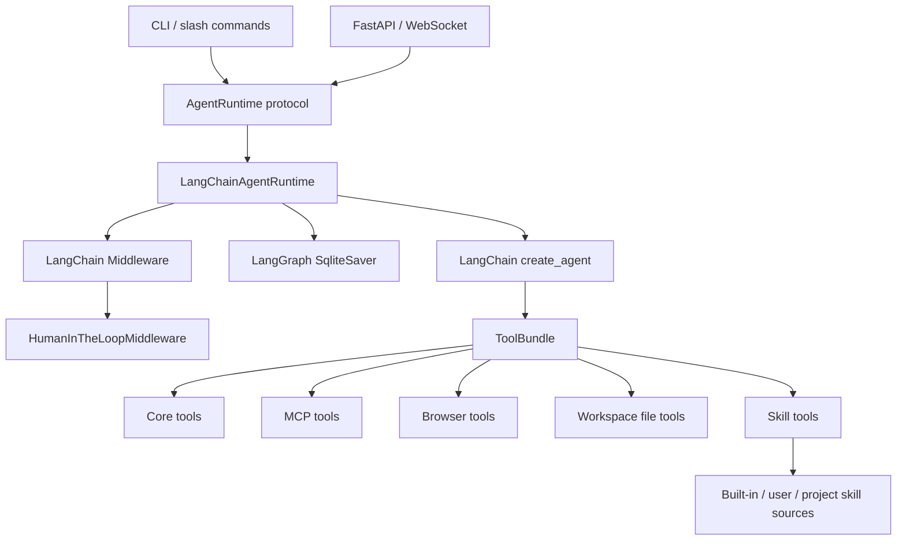

# LangChain Runtime Migration Design

> Date: 2026-05-09
> Status: proposed
> Scope: replace the DeepAgents runtime dependency with LangChain `create_agent` while preserving easy-claw user-facing behavior.

## Goal

Migrate easy-claw from `deepagents.create_deep_agent` to LangChain `create_agent` without rewriting the CLI, WebSocket API, MCP tool loading, storage, or slash-command surfaces.

The migration should keep these user-visible capabilities working:

- `uv run easy-claw` interactive chat.
- Single-shot `uv run easy-claw chat "..."`.
- WebSocket chat at `/ws/chat`.
- LangGraph SQLite checkpoint persistence by `thread_id`.
- Streaming token, tool-call, tool-result, approval, error, and done events.
- MCP tools loaded through `langchain-mcp-adapters`.
- Browser tools when enabled.
- Basic Memory MCP usage through the existing MCP configuration.
- easy-claw Markdown skills from built-in, user, and project skill directories.

## Non-Goals

- Do not replace LangGraph checkpointing.
- Do not rewrite the CLI or Web UI during the runtime migration.
- Do not introduce React, Vue, or a plugin marketplace as part of this work.
- Do not implement Docker, Windows Sandbox, or process isolation in this migration.
- Do not add native Anthropic, Gemini, or other non-OpenAI-compatible providers in this migration.
- Do not change the public slash-command contract.

## Current Baseline

Current dependencies include both DeepAgents and LangChain:

- `deepagents>=0.4.0`
- `langchain>=1.0.0`
- `langchain-openai>=1.0.0`
- `langgraph>=1.0.0`
- `langgraph-checkpoint-sqlite>=3.0.1`
- `langchain-mcp-adapters>=0.2.0`

Local runtime inspection on 2026-05-09 showed:

- `deepagents 0.5.5`
- `langchain 1.2.17`
- `create_deep_agent(...)` returns a LangGraph `CompiledStateGraph`.
- `create_agent(...)` also returns a LangGraph `CompiledStateGraph`.
- `HumanInTheLoopMiddleware(interrupt_on=...)` is available in `langchain.agents.middleware`.

The existing test baseline before migration was:

```powershell
uv run pytest
```

Result observed on 2026-05-09:

```text
131 passed, 2 skipped
```

And:

```powershell
uv run ruff check .
```

Result observed on 2026-05-09:

```text
All checks passed!
```

## Official References

- LangChain agents: https://docs.langchain.com/oss/python/langchain/agents
- LangChain human-in-the-loop: https://docs.langchain.com/oss/python/langchain/human-in-the-loop
- DeepAgents skills: https://docs.langchain.com/oss/python/deepagents/skills
- LangChain MCP adapters reference: https://reference.langchain.com/python/langchain-mcp-adapters/client/MultiServerMCPClient

## Current DeepAgents Coupling

The main coupling is in `src/easy_claw/agent/runtime.py`:

```python
agent = create_deep_agent(
    model=_build_chat_model(cfg.model, cfg.base_url, cfg.api_key),
    tools=tool_bundle.tools,
    system_prompt=system_prompt,
    skills=skill_sources or None,
    middleware=build_agent_middleware(
        max_model_calls=cfg.max_model_calls,
        max_tool_calls=cfg.max_tool_calls,
    ),
    backend=_build_agent_backend(workspace_path, request.skill_source_records),
    checkpointer=checkpointer,
    interrupt_on=interrupt_on,
)
```

DeepAgents-specific inputs in that call are:

- `skills=...`
- `backend=...`
- `interrupt_on=...` as a direct `create_deep_agent` argument

The rest of the project is already mostly LangChain or LangGraph compatible:

- Core tools use `langchain_core.tools.tool`.
- MCP tools use `langchain-mcp-adapters`.
- Middleware already imports `ModelCallLimitMiddleware` and `ToolCallLimitMiddleware` from `langchain.agents.middleware`.
- Checkpointing already uses `langgraph.checkpoint.sqlite.SqliteSaver`.
- Streaming and approval resume already use LangGraph-style `Command(resume=...)`.

## Target Runtime Shape

The target runtime call should use LangChain directly:

```python
from langchain.agents import create_agent

agent = create_agent(
    model=_build_chat_model(cfg.model, cfg.base_url, cfg.api_key),
    tools=[
        *tool_bundle.tools,
        *skill_tool_bundle.tools,
        *file_tool_bundle.tools,
    ],
    system_prompt=system_prompt,
    middleware=build_agent_middleware(
        max_model_calls=cfg.max_model_calls,
        max_tool_calls=cfg.max_tool_calls,
        interrupt_on=interrupt_on,
    ),
    checkpointer=checkpointer,
)
```

`create_agent` has no `skills` or `backend` parameter. Those responsibilities move into easy-claw-owned tools and prompt construction.

## Migration Mapping

| Current DeepAgents feature | Target LangChain replacement | Owner |
| --- | --- | --- |
| `create_deep_agent` | `langchain.agents.create_agent` | `src/easy_claw/agent/runtime.py` |
| `skills=[...]` | easy-claw skill summary prompt plus `list_skills` and `read_skill` tools | new `src/easy_claw/agent/skill_tools.py` |
| `LocalShellBackend` / `CompositeBackend` | workspace-bound file tools | new `src/easy_claw/tools/files.py` |
| direct `interrupt_on=...` argument | `HumanInTheLoopMiddleware(interrupt_on=...)` | `src/easy_claw/agent/middleware.py` |
| DeepAgents built-in file actions | `list_files`, `read_text_file`, `write_text_file`, `edit_text_file` | new file tools |
| `DeepAgentsRuntime` class name | `LangChainAgentRuntime` with temporary compatibility alias | `src/easy_claw/agent/runtime.py` |
| DeepAgents docs wording | LangChain runtime plus easy-claw skills | README and architecture docs after code is stable |

## Target Architecture



## Runtime Interfaces

Introduce neutral runtime protocols so the rest of the codebase does not depend on a concrete DeepAgents class name:

```python
from collections.abc import Iterable
from typing import Protocol

class AgentSession(Protocol):
    def run(self, prompt: str) -> AgentResult: ...
    def stream(self, prompt: str) -> Iterable[StreamEvent]: ...
    def close(self) -> None: ...

class AgentRuntime(Protocol):
    def run(self, request: AgentRequest) -> AgentResult: ...
    def open_session(self, request: AgentRequest) -> AgentSession: ...
```

During migration, keep compatibility aliases:

```python
DeepAgentsRuntime = LangChainAgentRuntime
DeepAgentSession = LangChainAgentSession
```

These aliases are temporary and should be removed only after README, docs, CLI, API, and tests no longer import the DeepAgents names.

## Skill Adapter Design

LangChain does not load `SKILL.md` directories natively. easy-claw should preserve the existing skill directory layout and implement its own adapter.

Existing supported sources remain:

- `skills/`
- `%USERPROFILE%\.deepagents\skills`
- `%USERPROFILE%\.deepagents\agent\skills`
- `%USERPROFILE%\.agents\skills`
- `%USERPROFILE%\.easy-claw\skills`
- `%USERPROFILE%\.claude\skills`
- `.deepagents\skills`
- `.agents\skills`
- `.easy-claw\skills`
- `skills` inside the active workspace

The adapter should expose two LangChain tools:

```python
@tool
def list_skills() -> str:
    """List available easy-claw skills with name, source, description, and path."""

@tool
def read_skill(name: str) -> str:
    """Read one easy-claw skill's SKILL.md and local helper file listing."""
```

The system prompt should include only a compact skill summary:

```text
可用 easy-claw skills 会通过 list_skills 和 read_skill 工具提供。
如果用户任务明显匹配某个 skill，请先调用 read_skill 读取完整说明，再执行任务。
```

This preserves progressive disclosure:

- The model sees that skills exist.
- The model can list them when needed.
- The model reads only the relevant skill body when needed.
- Helper files stay visible as file names first, not automatically injected into the model context.

Skill precedence remains the current `resolve_skill_sources` order: built-in first, then user, then project sources. If duplicate skill names exist, project-level sources should win during lookup because they are more specific to the active workspace. `list_skills` may show duplicates with source labels, but `read_skill(name)` should select the highest-priority matching name.

## Workspace File Tool Design

DeepAgents currently contributes built-in filesystem actions through its backend. LangChain will not provide those actions automatically.

Add `src/easy_claw/tools/files.py` with these tools:

- `list_files(pattern: str = "**/*") -> str`
- `read_text_file(path: str) -> str`
- `write_text_file(path: str, content: str) -> str`
- `edit_text_file(path: str, old: str, new: str) -> str`

Rules:

- All relative paths resolve under `ToolContext.workspace_path`.
- Absolute paths are allowed only if they resolve inside `ToolContext.workspace_path`.
- `read_text_file` refuses binary files by attempting UTF-8 decode and returning a clear error on decode failure.
- `write_text_file` creates parent directories only under the workspace.
- `edit_text_file` performs exact single-string replacement.
- If `old` appears zero times, return an error that no replacement was made.
- If `old` appears more than once, return an error asking for more context.
- Do not delete files in this migration.
- Do not add recursive move or bulk rewrite tools in this migration.

These tools should return short, user-readable status strings. They should not return Python exceptions to the model unless an unexpected internal error occurs.

Risk mapping:

- `list_files`: no approval by default.
- `read_text_file`: no approval by default.
- `write_text_file`: approval in `balanced` and `strict`.
- `edit_text_file`: approval in `balanced` and `strict`.

## Approval Migration

Current approval logic:

- `permissive` returns `{}`.
- `balanced` and `strict` use tool bundle interrupt policy.
- DeepAgents receives that policy through `create_deep_agent(..., interrupt_on=...)`.

Target approval logic:

- Keep `_build_interrupt_on(approval_mode, tool_interrupt_on)`.
- Change `build_agent_middleware` to accept `interrupt_on`.
- Append `HumanInTheLoopMiddleware(interrupt_on=interrupt_on)` when `interrupt_on` is not empty.

Target middleware builder:

```python
from langchain.agents.middleware import (
    HumanInTheLoopMiddleware,
    ModelCallLimitMiddleware,
    ToolCallLimitMiddleware,
)

def build_agent_middleware(
    *,
    max_model_calls: int | None = DEFAULT_MAX_MODEL_CALLS,
    max_tool_calls: int | None = DEFAULT_MAX_TOOL_CALLS,
    interrupt_on: dict[str, object] | None = None,
) -> tuple[object, ...]:
    middleware: list[object] = []
    if max_model_calls is not None:
        middleware.append(ModelCallLimitMiddleware(run_limit=max_model_calls))
    if max_tool_calls is not None:
        middleware.append(ToolCallLimitMiddleware(run_limit=max_tool_calls))
    if interrupt_on:
        middleware.append(HumanInTheLoopMiddleware(interrupt_on=interrupt_on))
    return tuple(middleware)
```

The existing `ConsoleApprovalReviewer`, `StaticApprovalReviewer`, `_invoke_with_approval`, and `_stream_with_approval` should remain until tests show LangChain produces a different interrupt payload shape. If the payload differs, adjust `_get_action_requests` and `_read_field` only; do not rewrite CLI or WebSocket approval flows.

## Naming Strategy

Use a two-step naming migration:

1. Add new neutral names while keeping old aliases.
2. Update call sites and documentation.
3. Remove old aliases in a later cleanup release.

Recommended names:

- `LangChainAgentRuntime`
- `LangChainAgentSession`
- `AgentRuntime`
- `AgentSession`
- `build_skill_tool_bundle`
- `build_file_tool_bundle`

Temporary compatibility:

- `DeepAgentsRuntime = LangChainAgentRuntime`
- `DeepAgentSession = LangChainAgentSession`
- `resolve_deepagents_skill_source_paths` remains as an alias until docs and tests stop referencing it.

## File-Level Change Plan

Create:

- `src/easy_claw/agent/protocols.py`
- `src/easy_claw/agent/skill_tools.py`
- `src/easy_claw/tools/files.py`
- `tests/test_skill_tools.py`
- `tests/test_file_tools.py`

Modify:

- `src/easy_claw/agent/runtime.py`
- `src/easy_claw/agent/middleware.py`
- `src/easy_claw/agent/toolset.py`
- `src/easy_claw/agent/types.py`
- `src/easy_claw/skills.py`
- `tests/test_agent_runtime.py`
- `tests/test_agent_middleware.py`
- `tests/test_agent_toolset.py`
- `tests/test_skills.py`
- `pyproject.toml`
- `README.md`
- `docs/architecture.md`
- `docs/skills.md`

Do not modify in the first implementation pass:

- `src/easy_claw/api/main.py`
- `src/easy_claw/cli_interactive.py`
- `src/easy_claw/cli_slash.py`
- `src/easy_claw/storage/*`

Only update API or CLI if imports require a name change. Runtime behavior should remain behind the existing request/session interfaces.

## Test Strategy

The migration is not complete until these commands pass:

```powershell
uv run pytest
uv run ruff check .
```

Manual smoke tests:

```powershell
uv run easy-claw doctor
uv run easy-claw chat "总结 README.md 的主要内容"
uv run easy-claw dev skills list --all-sources
```

If API behavior is touched:

```powershell
uv run easy-claw serve
```

Then open:

```text
http://127.0.0.1:8787/health
http://127.0.0.1:8787/skills
http://127.0.0.1:8787/mcp
```

## Risk Register

| Risk | Cause | Mitigation |
| --- | --- | --- |
| Skills no longer trigger naturally | LangChain has no native `skills` parameter | Add skill summary to system prompt and expose `list_skills` / `read_skill` tools |
| File editing disappears | DeepAgents backend provided built-in file tools | Add easy-claw-owned workspace file tools before removing DeepAgents |
| Approval stops working | `interrupt_on` moves from DeepAgents argument to middleware | Test `HumanInTheLoopMiddleware` with fake agent interrupts and real tool policies |
| Stream event parsing changes | LangChain stream messages may differ from DeepAgents stream messages | Keep `_events_from_stream_item` permissive and add tests for tool call and tool result messages |
| Tests overfit old class names | Existing tests assert `DeepAgentsRuntime` behavior | Add compatibility aliases first, then rename assertions incrementally |
| Docs drift during migration | README and architecture currently describe DeepAgents as core runtime | Update docs only after code and tests pass |
| Security regression from new file tools | New write/edit tools could write outside workspace | Centralize path resolution and test workspace escape attempts |

## Rollback Plan

Use a two-runtime transition until the LangChain runtime is stable:

- Keep the old DeepAgents runtime implementation in git history.
- Keep compatibility aliases while changing call sites.
- Make the removal of `deepagents` from `pyproject.toml` the final step, not the first step.

If the LangChain runtime fails late in migration:

1. Revert `src/easy_claw/agent/runtime.py` to the last DeepAgents implementation.
2. Keep newly added `files.py` and `skill_tools.py` only if tests show they are isolated and useful.
3. Restore `deepagents>=0.4.0` in `pyproject.toml`.
4. Run `uv sync`, `uv run pytest`, and `uv run ruff check .`.

Do not delete existing skill directories or user skill discovery paths during rollback.

## Completion Criteria

The migration is complete when:

- `pyproject.toml` no longer depends on `deepagents`.
- `uv.lock` no longer resolves `deepagents`.
- `src/easy_claw/agent/runtime.py` imports `create_agent` from `langchain.agents`.
- No production code imports `deepagents`.
- `uv run pytest` passes.
- `uv run ruff check .` passes.
- CLI chat can answer a simple README summarization prompt.
- Skill listing still reports built-in, user, and project skill sources.
- `balanced` approval mode still interrupts before risky tools.

## Implementation Order

1. Add neutral runtime/session protocols and compatibility aliases.
2. Add LangChain runtime using existing tools and checkpointing.
3. Move approval policy into `HumanInTheLoopMiddleware`.
4. Add workspace file tools and include them in `ToolBundle`.
5. Add skill adapter tools and prompt instructions.
6. Update tests around runtime, middleware, file tools, and skills.
7. Update docs and README.
8. Remove the DeepAgents dependency.
9. Run full verification.

